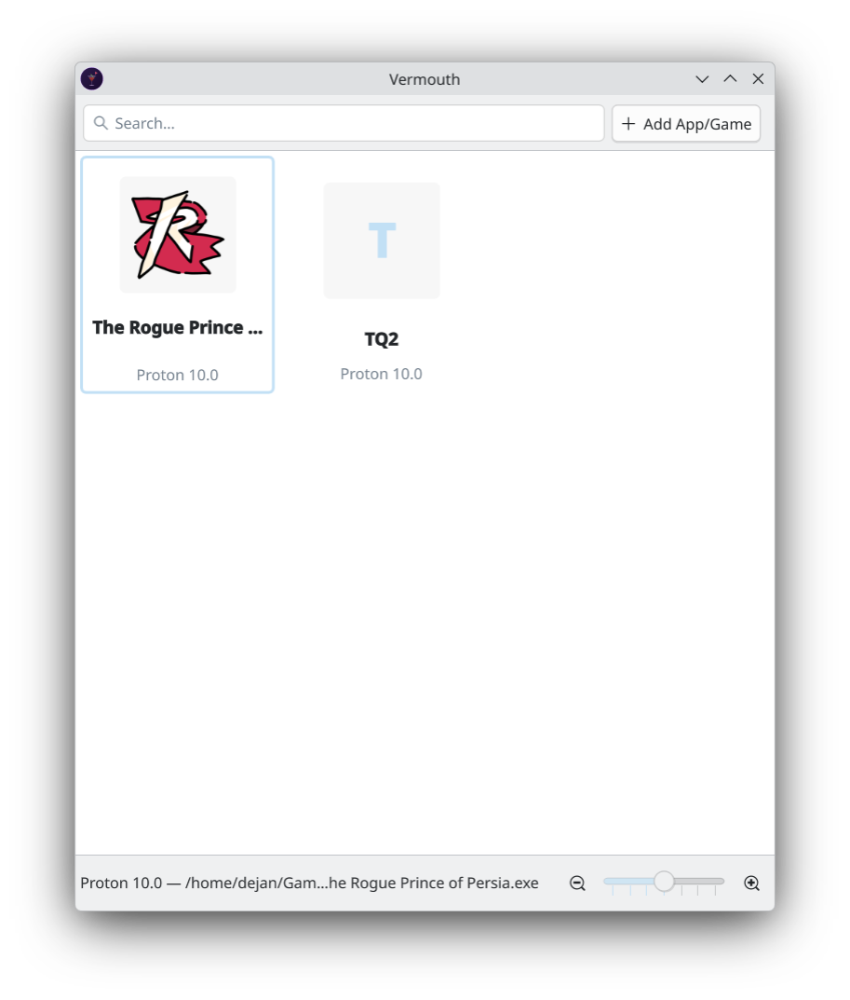
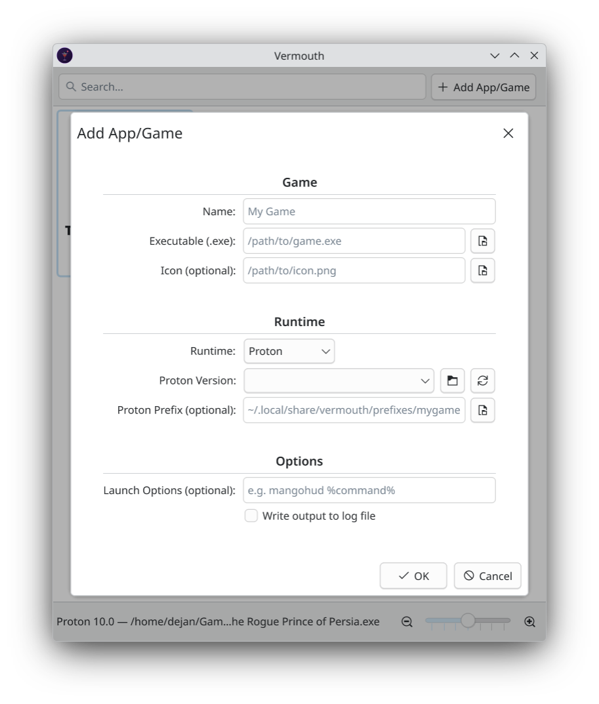

<p align="center">
  
</p>

<h1 align="center">Vermouth</h1>

<p align="center">A no-frills game (or any Windows exe) launcher for KDE.<br>
Point it at Windows executables and run them with Proton or Wine.</p>

<p align="center">
  
  
</p>

## What it does

Vermouth keeps a list of your games and applications, paired with a Proton or Wine version. Double-click to launch. That's pretty much it.
It works like Lutris, Heroic, Fagus or Bottles, but:

- it's KDE first
- tries to be lighter and easier to use by letting other apps manage the compatibility tools (e.g. Steam, Protonup-qt etc.) and the complex stuff.

Additionally:

- Picks up Proton versions from your Steam installation automatically, including custom ones like GE-Proton from compatibilitytools.d and across multiple Steam library folders
- You can install custom proton builds in it's local folder (usually ~/.local/share/vermouth/protons, there's a button for it)
- Wine works too - just point it at the Wine binary and set a prefix folder
- It tries to extract icons from .exe files so the grid actually looks nice, just install `icoutils`
- Launch options with `%command%` placeholder, same as Steam (e.g. `mangohud %command%`)
- Run a separate .exe inside an existing prefix (useful for installers, config tools, etc.)
- Create start menu entries or desktop shortcuts for individual games
- Can be launched from .desktop files directly, so shortcuts work without opening the application


## Installing

There are some packages provided in the releases section - specifically deb, rpm and flatpak. There's an AppImage too but it might not work, I still have some kinks to fix there. Not that the other packages work flawlessly, so please, try them and report bugs!


Currently only tested on Fedora 43.

## Building from source

You need Qt 6 and CMake. On Fedora:

```
sudo dnf install qt6-qtbase-devel qt6-qtdeclarative-devel cmake gcc-c++
```

Then:

```
cmake -B build
cmake --build build
./build/bin/vermouth
```

For icon extraction from .exe files, install `icoutils` (provides `wrestool` and `icotool`).

I'll follow up with build instructions for other distros as the code matures.

## How it works

Games are stored in `~/.config/vermouth/apps.json`. Proton is launched the same way Steam does it, by calling the `proton run` script with `STEAM_COMPAT_DATA_PATH` set to your prefix. Wine games just get `WINEPREFIX` set and the binary called directly.

The launch options field lets you wrap the command with tools like mangohud, gamescope, or gamemoderun. Use `%command%` as the placeholder for where the actual game command goes. If you leave out `%command%`, your options get prepended automatically.

## AI Disclaimer

The code has been developed, reviewed and tested by a human. However, development included assistance of AI tools, so keep that in mind.
